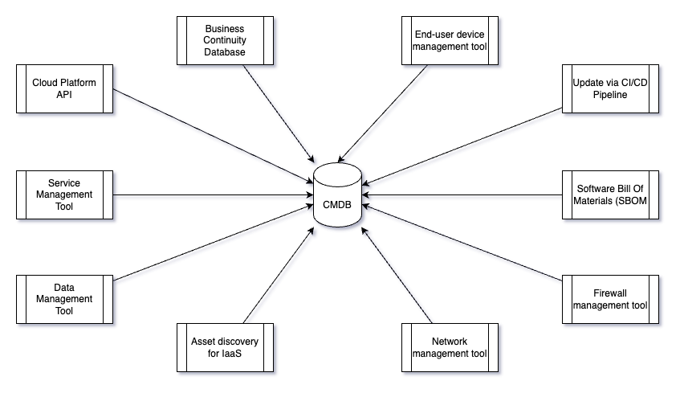

# CIS Control 1

| Document Information |
------------------------|
| Category: Assurance Guidance |
| Created: 2022-03-22 |
| Domain: Security |
| Author: pete.dingwall@education.gov.uk |

## Control 1.1

| Asset Type | Security Function | Title| 
---| ---| ---|
| Devices | Identify | Establish and Maintain Detailed Enterprise Asset Inventory

### The Control

Establish and maintain an accurate, detailed, and up-to-date inventory of all enterprise assets with the potential to store or process data, to include: end-user devices (including portable and mobile), network devices, non-computing/IoT devices, and servers.

Ensure the inventory records the network address (if static), hardware address, machine name, enterprise asset owner, department for each asset, and whether the asset has been approved to connect to the network. For mobile end-user devices, MDM type tools can support this process, where appropriate.

This inventory includes assets connected to the infrastructure physically, virtually, remotely, and those within cloud environments. Additionally, it includes assets that are regularly connected to the enterprise’s network infrastructure, even if they are not under control of the enterprise. Review and update the inventory of all enterprise assets bi-annually, or more frequently.

### Why it is required

This is the key control which must be implemented fully to ensure that devices on the IT estate are known and well managed. Operations and security teams cannot support and secure the full estate if they do not have visibility of all devices.

Link to NCSC's guidance, ISO27001 etc - know your estate, if you don't know your assets how can you secure etc.

### How it is achieved

The outcome required is for all devices to be captured and maintained within a central repository. The method of achieving this is different depending on the type of device and should be aligned with processes and ways of working to ensure that it is easily achieved and managed. 

Service owners and delivery teams will be expected to select the optimal method to update and maintain their devices and demonstrate evidence of this.

* The Config Management Database (CMDB) is the master repository for all devices wihtin the Department.
* Software Bill Of Materian (SBOM) can be created and maintained as part of standard CI/CD processes to maintain the up-to-date view of software components and configuration for a service
* CMDB can be updated programatically within a CI/CD pipeline to update and manage components as they're deployed and updated
* Device information can be gathered directly from the master source for the relevant information
  * Network Managment
  * Device Management
  * Cloud platforms

*Compliance for this control is met when 100% of a services' assets are captured and maintained. Less than 100% of all assets will result in non-compliance with this control*

## Control 1.2

| Asset Type | Security Function | Title| 
---| ---| ---|
| Devices |Respond |Address Unauthorized Assets |

### The Control
Ensure that a process exists to address unauthorized assets on a weekly basis. The enterprise may choose to remove the asset from the network, deny the asset from connecting remotely to the network, or quarantine the asset.

### Why it is required

Keep an updated record of what's on the estate and remove stuff which shouldn't be there. Helps to highlight unauthorised stuff etc.

### How it is achieved

*TBC at present for an enterprise-wide approach, no consistent way of doing this, onus on the servers keeping their records up to date*
