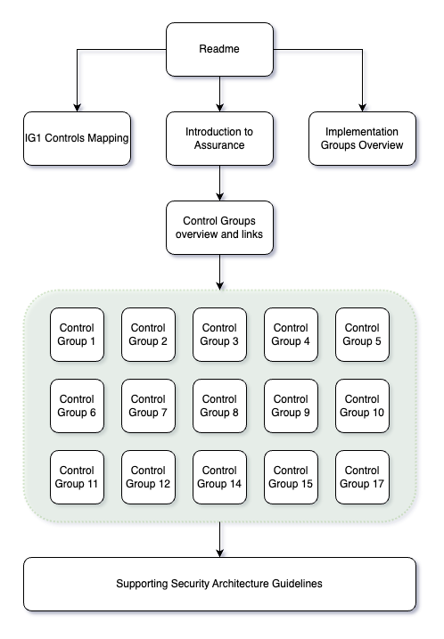

# Standard Assurance Processes

This folder contains an overview of the Department's assurance processes and guidelines to help service teams to apply the required controls and meet requirements defined by the Department's assurance processes.

**Security Assurance Guidelines**:

* Provide a high-level mapping between the CAF controls, the respective guidelines and (where relevant) shared services which are used to record specific information required for the Department's return

* Are guidelines which will enable teams to shift-left with their assurance processes

* Will enable delivery and support teams to provide a return to Cyber and Information Security (C&IS) directly without requiring oversight and support from C&IS.

* Consist of background and rationale, and best practice guidance for consistency and security

* Provide links within the guidelines to the respective CAF controls and the guideline which supports it.

**Intended audience** - All DfE users, contractors and Managed Service Providers working on behalf of the DfE

[Introduction to Assurance](../Assurance/ASU-SEC001-Introduction-to-Assurance.md)

[Overview of Implementation Groups](../Assurance/ASU-SEC002-Implementation-Groups.md)

[Mapping of Controls to Department artefacts and outputs](../Assurance/ASU-SEC003-Controls-Mapping.md)

[Controls Groups](../Assurance/ASU-SEC004-Controls-Overview.md)

