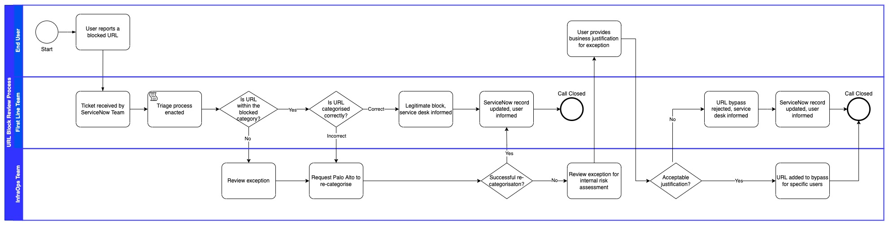
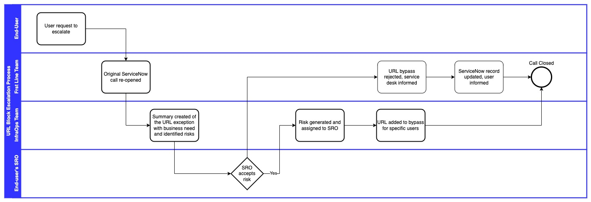

# Web Filtering Briefing Note

| Document Information |
------------------------|
| Category: Briefing Note |
| Created: 2022-03-22 |
| Domain: Security |
| Author: pete.dingwall@education.gov.uk |
| References: BRF-SEC002 - Web Filtering |

# Baseline guidelines for Web Filtering and Internet access

The following briefing note is provided to guide Department operational teams when managing access to Internet sites, and managing requests for access from the Department's users.

**Exceptions** to the guidance within this briefing note will be handled by following the process outlined within this note.

**Updates or modifications** to the guidance will be handled via requests from the operational teams and updated within this briefing if required.

**Escalations** will be dealt with by following th eprocess outlined within this guidance.

## Introduction and definitions

This guidance applies to how the Department's users access Internet sites and services. **Web Filtering** refers to controls which the Department applies for our users to protect their access to inappropriate or malicious sites and services.

These controls are applied transparently for our users when working within a Department office or accessing remotely via the Department's standard remote access solutions.

This guidance refers to **Web Filtering Categorisations**, which are standard categories of sites and services accessed via the Internet. The categories are provided via the provider of our Web Filtering service which uses industry standard definitions of sites and services and groups into standard categories.

These categories can then be used to manage access to the Internet by restricting access to specific categories which are not deemed suitable for a business enviroment.

## Security and operational requirements

The guidelines are provided for baseline guidance for the definition of standard and exceptional access for Internet sites and services from the Departments users, devices and services. The guidance clarifies the requirements for web filtering from a security perspective and the roles and responsibilities between the Security and Operational teams.

The approach from the Department is to apply base levels of controls only to ensure that our users are provided with the required access to the Internet whilst protectig them from common malicious activity.

**Security** within this guidance refers to the Cyber and Information Security Division

**Operational** within this guidance refers to the Infrastructure and Operations team

## Security requirements

The Security team's focus and need is to ensure that the Department's users are able to access internet sites and services safely and securely.

Internet sites are often used for malicious activity such as gaining access to data, personal information or to install malicious software onto a user's PC. Our Department's users could also be specifically targeted due to the data and systems we have access to, so it is essential that our access to the Internet is protected and secured.

### Protective Domain Name Service

Baeline security needs are met with the integration of the Protective Domain Name Service (PDNS) into the standard web filtering service. PDNS blocks access to known malicious sites and endpoints and is automatically updated as new sites are identified. This does not provide complete protection against all malicious sites and services but is part of a defence-in-depth approach which works with other protective measures to protect our users.

### Web Filtering Categorisation

The Department's web filtering service provides a number of categorisations which are automatically managed by the service provider. The application of these filters provide further protection as part of the defence-in-depth approach:

 - **Malware** - any sites which are categorised as a malware threat will be automatically blocked. These are sites which are known to host malware which could infect the Department's devices, or which are used for malicious use

 - **Newly Registered Domains** - any sites which have recently been created and registered will be blocked. These could be an indicator of suspicious  activity as malicious users often create a new domain to temporarily hold data or host services which are used to control 'bots'

## Department baselines

 The Department applie baseline filtering for services which are not suitable or applicable for business use.

 - Category

 - Category

## Logging and monitoring

The Department will log and monitor all Internet traffic both from Department-issued devices and 3rd-party devices which are used to carry out work on behalf of the Department. Information which is gathered is not routinely inspected, but will be made available as appropriate for any investigations as appropriate and within the Department's standard HR and IT policies.

## Processes to manage exceptions

