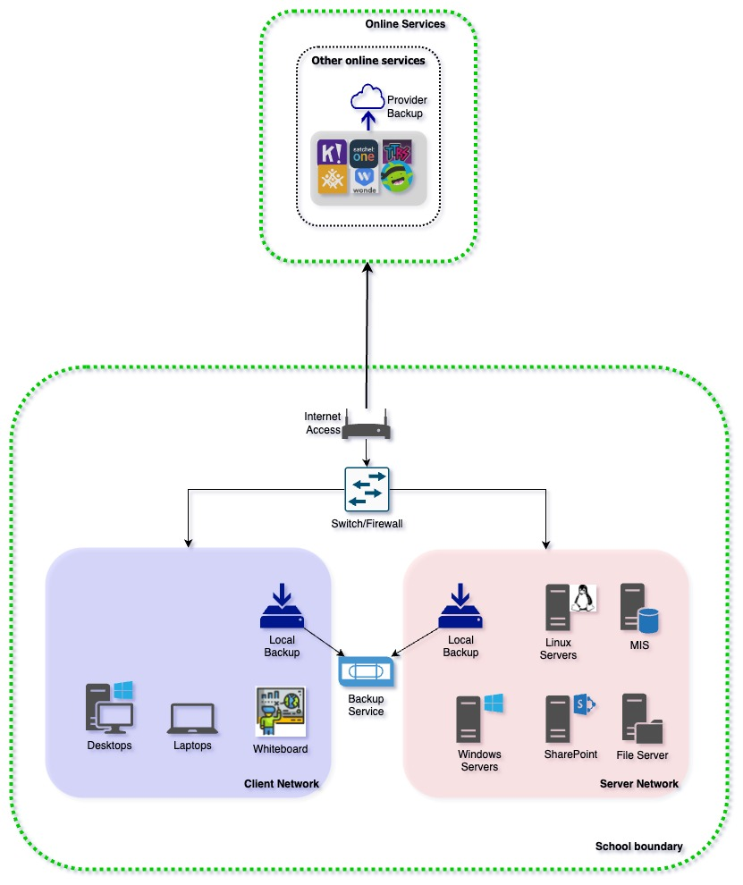
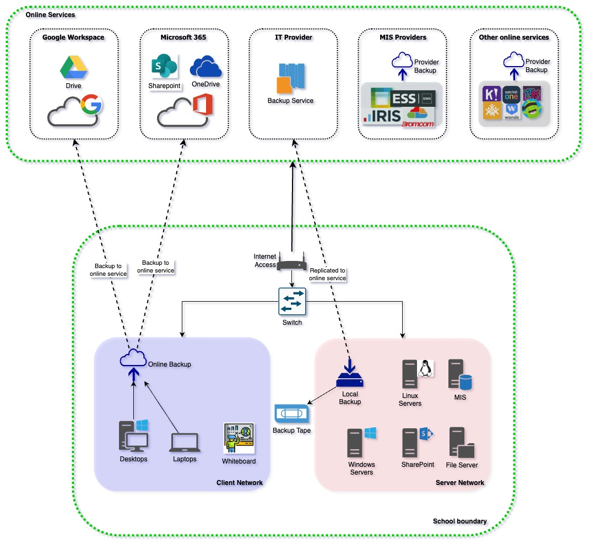
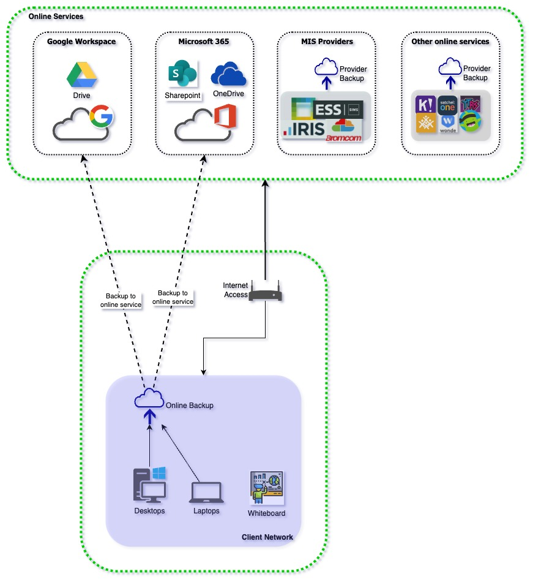

# Backups for Schools

| Document Information |
---|
| Category: Architecture Guidelines |
| Created: 2022-12-15 |
| Domain: Security and Infrastructure |
| Author: pete.dingwall@education.gov.uk |
| References: [NCSC 321 Backup Guidance](https://www.ncsc.gov.uk/blog-post/offline-backups-in-an-online-world)|

## Introduction and Background

Schools are advised to ensure that they have a full backup for their  digital systems so they are able to recover in the event of a business continuity or cyber security incident.

### Risk Protection Arrangement cover

A backup is also a condition for the Department's Risk Protection Arrangement (RPA) to ensure that the team responding to a cyber security incident are able to recover the school's services. This is covered in Section 14 of the following published documents:

- [Academy Trusts](https://assets.publishing.service.gov.uk/government/uploads/system/uploads/attachment_data/file/1099738/RPA_membership_rules_for_academy_trusts.pdf)

- [Church Academies](https://assets.publishing.service.gov.uk/government/uploads/system/uploads/attachment_data/file/1099697/RPA_membership_rules_church_academies.pdf)

- [Local Authority maintained schools](https://assets.publishing.service.gov.uk/government/uploads/system/uploads/attachment_data/file/1064042/RPA_membership_rules_LAMS.pdf)

- [Voluntary aided, foundation and foundation special schools](https://assets.publishing.service.gov.uk/government/uploads/system/uploads/attachment_data/file/1064040/RPA_membership_rules_VA__foundation_and_foundation_special.pdf)

- [Voluntary controlled schools](https://assets.publishing.service.gov.uk/government/uploads/system/uploads/attachment_data/file/1064038/RPA_membership_rules_VC_schools.pdf)

> **Do we class BCP as a need for offline backups too?**

### NCSC's 321 Guidance

Schools are directed to the existing guidance from NCSC (linked at the top of this document) to ensure that the backup solution meets the necessary requirements and is protected from an incident which has impacted other school services and infrastructure. The guidance refers to "digitally-disconnected" backups to explain how separation is required between production services and backups, but schools and school suppliers have found this terminology confusing and have required further clarity to understand whether their backup solution meets the RPA conditions of cover.

## Use of the guidelines

The following guidelines are provided to allow schools to better understand how disconnected backups protect against common cyber attacks, and to verify whether their backup solution meets the conditions required for the RPA cover.

**Updates, clarifications or modifications** to the principles can be requested via the [Sector Security Enquiries mailbox](mailto:sector.securityenquiries@education.gov.uk)

---

## Best Practices for backups

### 1 - Review the published Cyber Security standards

*Existing guidance can be used for broad best practices and principles*

#### Why?

The Department have published a set of Cyber Security standards for schools to help to build cyber resilience and protect from common cyber threats..

#### How?

- Review the cyber standards found [here](https://www.gov.uk/guidance/meeting-digital-and-technology-standards-in-schools-and-colleges/cyber-security-standards-for-schools-and-colleges)

#### Why?

- Adherence to the standard ***Protect all devices on every network with a propery configured boundary or software firewall*** can protect a schools' backups from malicious activity on other networks

- Adherence to the standard ***Accounts should only have access they require to perform their role...*** ensures that only authorised personnel can access a schools' backups, and protects against stolen credentials being used for malicious purposes such as deleting or encrypting backup data.

- Adherence to the standard ***You should have at least 3 backup copies of important data...*** ensures that backups are protected from accidental damage or failure due to a localised IT issue or site loss

### 2 - Utilise a backup solution which can be disconnected and off-site

*Common cyber incidents use local networks to spread and infect other machines*

#### How?

- If you're responsible for IT procurement in your school, select a backup solution which can be separated from the main school's network and stores a copy of back-up data on an off-site location

- If your MSP is responsible for the schools IT services, ensure that they are aware of and comply with NCSC's 321 guidance

---

## Frequently Asked Questions (FAQ)

### **What are 'digitally-disconnected' backups?**

The term 'digitally-disconnected' is used within NCSC's 321 guidance to explain the need to separate backups so they can be protected from malicious activity which could spread from one network to another.

If data is secured within a cloud backup solution it must be disconnected to protect from this malicious activity, but it's not possible to physically disconnect the cloud solution physically, hence the term 'digitally disconnected', which refers to the ability to block the connection to protect the data.

The methods to digitally-disconnect data are further described in the remaining FAQs below.

### **My school uses a service which includes a cloud backup, does this meet the requirement?**

Popular collaboration and modern workplace platforms such as Google Workplace and Microsoft 365 include data storage as part of their service with products such as OneDrive, SharePoint and Drive. 

Whilst these solutions provide a backup to protect against file deletions and provide the ability to roll-back to different versions, they do not provide protection against malicious activity. These products utilise a synchronisation tool to copy data from end-user devices to the file storage service, and this synchronisation can also cause corrupted data to spread to the synchronised copy in the cloud.

### We are considering xxx cloud backup solution, does this meet the requirement? 

### What is defined as 'critical data'?

### Do we need to backup all data, including on-premise and cloud data?

### Do 'immutable' backups meet the RPA requirement to secure backups?

### Backing up online data to an offline backup adds further cost to my IT services, is this really required?

### What is a cold storage backup?

### My school is part of a multi-academy trust. Can data from one school be backed up to another as an 'off-site' backup?

### Does a tape backup meet the requirement for an offline or off-site backup?

### We are a cloud-first school and do not have any onsite servers. Do we need an offline backup?

### Does an on-premise secure backup solution meet the requirement?

### Do I need to backup data which is held within a cloud-hosted application?

---

## Appendix - Example school configurations

There is no single explanation of how schools should meet the NCSC guidance and align to best practices, as this is dependent on the school's use of IT and the services they are using. The following examples explore some standard configurations for a school's IT systems.

### On-premise school

A school is which runs its key systems from standard hardware which is located on the schools premises or in a location which is accessed by schools within the Acadamy Trust.

### Hybrid school

A school is which runs its key systems from a mixture of standard hardware which is located on the schools premises and from cloud-hosted applications and systems provided 'as-a-service' by a 3rd party vendor.

### Cloud-first school

A school is which runs its key systems from cloud-hosted applications and systems provided 'as-a-service' by a 3rd party vendor.

