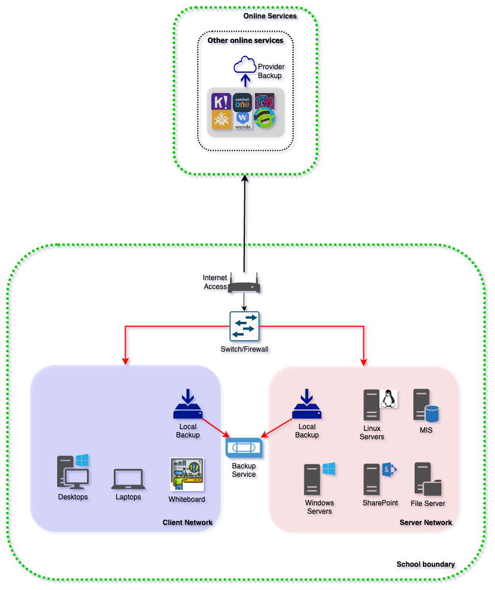
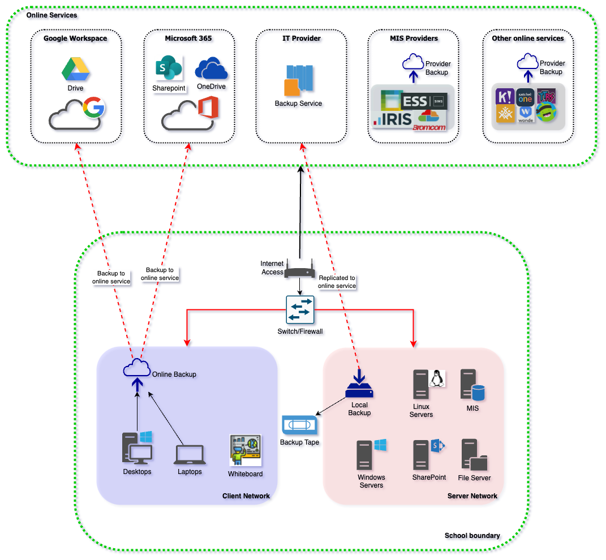
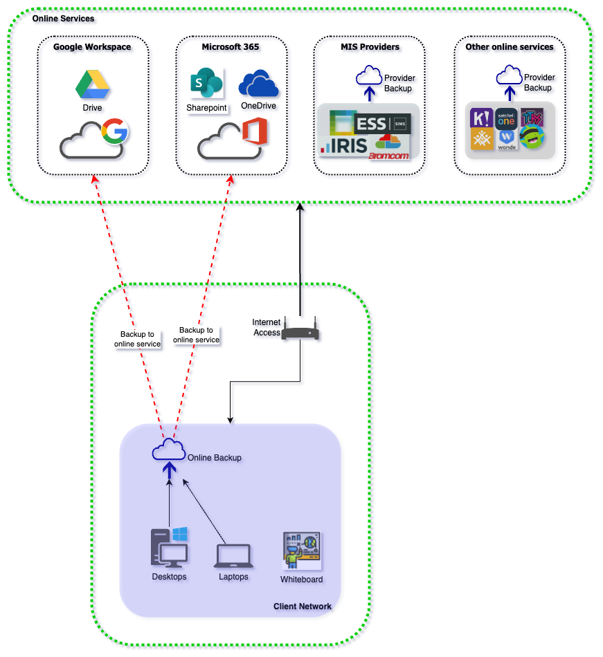

# Backups for Schools

| Document Information |
---|
| Category: Architecture Guidelines |
| Created: 2022-12-15 |
| Domain: Security and Infrastructure |
| Author: pete.dingwall@education.gov.uk |
| References: [NCSC 321 Backup Guidance](https://www.ncsc.gov.uk/blog-post/offline-backups-in-an-online-world)|

## Introduction and Background

Schools are advised to ensure that they have a full backup for their  digital systems so they are able to recover in the event of a business continuity or cyber security incident.

### Risk Protection Arrangement cover

A backup is also a condition for the Department's Risk Protection Arrangement (RPA) to ensure that the team responding to a cyber security incident are able to recover the school's services. This is covered in Section 14 of the following published documents:

- [Academy Trusts](https://assets.publishing.service.gov.uk/government/uploads/system/uploads/attachment_data/file/1099738/RPA_membership_rules_for_academy_trusts.pdf)

- [Church Academies](https://assets.publishing.service.gov.uk/government/uploads/system/uploads/attachment_data/file/1099697/RPA_membership_rules_church_academies.pdf)

- [Local Authority maintained schools](https://assets.publishing.service.gov.uk/government/uploads/system/uploads/attachment_data/file/1064042/RPA_membership_rules_LAMS.pdf)

- [Voluntary aided, foundation and foundation special schools](https://assets.publishing.service.gov.uk/government/uploads/system/uploads/attachment_data/file/1064040/RPA_membership_rules_VA__foundation_and_foundation_special.pdf)

- [Voluntary controlled schools](https://assets.publishing.service.gov.uk/government/uploads/system/uploads/attachment_data/file/1064038/RPA_membership_rules_VC_schools.pdf)

> **A separate offline backup would also be essential in the event of a business continuity situation where on-premise systems are no longer available, potentially due to fire, building damage, flooding etc. Whilst BCP is not in-scope of this guidance it it highlighted here for awareness.**

### NCSC's 321 Guidance

Schools are directed to the existing guidance from NCSC (linked at the top of this document) to ensure that the backup solution meets the necessary requirements and is protected from an incident which has impacted other school services and infrastructure. The guidance refers to "digitally-disconnected" backups to explain how separation is required between production services and backups, but schools and school suppliers have found this terminology confusing and have required further clarity to understand whether their backup solution meets the RPA conditions of cover.

## Use of the guidelines

The following guidelines are provided to allow schools to better understand how disconnected backups protect against common cyber attacks, and to verify whether their backup solution meets the conditions required for the RPA cover.

**Updates, clarifications or modifications** to the principles can be requested via the [Sector Security Enquiries mailbox](mailto:sector.securityenquiries@education.gov.uk)

---

## Best Practices for backups

### 1 - Review the published Cyber Security standards

*Existing guidance can be used for broad best practices and principles*

#### Why?

The Department have published a set of Cyber Security standards for schools to help to build cyber resilience and protect from common cyber threats. These standards provide a baseline set of best practice guidance and controls to help schools.

Adherence to the standard ***Protect all devices on every network with a properly configured boundary or software firewall*** can protect a schools' backups from malicious activity on other networks

Adherence to the standard ***Accounts should only have access they require to perform their role...*** ensures that only authorised personnel can access a schools' backups, and protects against stolen credentials being used for malicious purposes such as deleting or encrypting backup data.

Adherence to the standard ***You should have at least 3 backup copies of important data...*** ensures that backups are protected from accidental damage or failure due to a localised IT issue or site loss

#### How?

- Review the cyber standards found [here](https://www.gov.uk/guidance/meeting-digital-and-technology-standards-in-schools-and-colleges/cyber-security-standards-for-schools-and-colleges)

### 2 - Utilise a backup solution which can be disconnected and off-site

*Common cyber incidents use local networks to spread and infect other machines*

#### Why?

Cyber criminals often target backups when carrying out malicious activity to restrict a school's ability to restore their systems. This could involve encrypting data within a backup solution or deleting backups completely to ensure that schools have to comply with ransom demands to recover their systems and data.

Separating backup solutions into separate networks or using other methods of offline media ensures that these backups cannot easily be targeted by cyber criminals.

#### How?

- If you're responsible for IT procurement in your school, select a backup solution which can be separated from the main school's network and stores a copy of back-up data on an off-site location

- If your MSP is responsible for the schools IT services, ensure that they are aware of and comply with NCSC's 321 guidance

### 3 - Follow Least Privilege best practices to protect against re-used credentials and malicious attacks

*Limiting privileged access can stop malicious activity spreading into key systems and services*

#### Why?

Cyber criminals will gain access to a school's network and systems via an end-user's credentials, which have either been guessed due to a weak password or due to a password which has been re-used across other systems.

Once a criminal has an end-user's credentials they will attempt to access other systems within the schools network by re-using these credentials. This is referred to as 'lateral movement' and is made possible by users having access to multiple systems and services from a single account.

Whilst providing access to mutliple systems is preferable for an end-user, it increases risk for an end-user and the school's systems if this account is compromised.

Least Privilege principles dictate that privileges are only granted to users who require them, and are only enabled when they're required.

#### How?

- Restrict access to a school's systems to only those who require them
- Utilise 'Just-in-Time' solutions and processes to only grant access to systems when required and on a time-limited basis
- Conduct regular access reviews to ensure that access to these key systems remains appropriate
- Ensure that your service provider is following least-privilege appoaches and request evidence and regular reporting to demonstrate this
- Apply specific scrutiny to your service providers working practices if they work across numerous schools and trusts to ensure that they are segregating access as appropriate (ie an administrator does not have access to multiple schools and services from a single account)

---

## Frequently Asked Questions (FAQ)

### **Why is the backup condition required for RPA cover?**

RPA cyber cover is focussed on both proactive activities to build a schools understanding of cyber risk and reactive activities to help a school to recover from a cyber incident. The Incident Response team will help a school to recover their systems so the school can return to operation.

Backups are the last line of defence to ensure that data which might have been either encrypted or destroyed can be recovered, if a backup does not exist it will not possible to restore services.

### **What are 'digitally-disconnected' backups?**

The term 'digitally-disconnected' is used within NCSC's 321 guidance to explain the need to separate backups so they can be protected from malicious activity which could spread from one network to another.

If data is secured within a cloud backup solution it must be 'disconnected' from othe production services to protect from this malicious activity. It's not possible to physically disconnect the cloud solution physically, hence the term 'digitally disconnected', which refers to the ability to block connections to the backups to protect the data and apply controls to ensure that only the correct personnel have access to the backup data.

### **My school uses a service which includes a cloud backup, does this meet the requirement?**

Popular collaboration and modern workplace platforms such as Google Workplace and Microsoft 365 include data storage as part of their service with products such as OneDrive, SharePoint and Drive. 

Whilst these solutions provide a backup to protect against file deletions and provide the ability to roll-back to different versions, they do not provide protection against malicious activity, specifically Ransomware. These products utilise a synchronisation tool to copy data from end-user devices to the file storage service, and this synchronisation can also cause corrupted data to spread to the synchronised copy in the cloud.

### **We are considering xxx cloud backup solution, does this meet the requirement?**

There are many varied cloud backup solutions available for schools, so it is not possible to provide a single response for this. The suitability of the cloud backup solution will depend on the levels of separation it provides and whether it would be protected against malicious activity which occurred on the school's networks.

Rather than provide a list of services which meet the RPA requirements, schools should review this guidance and the guidance from NCSC and select a suitable solution.

### **What is defined as 'critical data'?**

Critical data will be identfied by the school as part of their business continuity planning and Cyber Response Plan. This will differ from school to school depending on systems used for MIS, financial management, data storage etc and is the school's responsibility to identify and maintain.

### **Do we need to backup all data, including on-premise and cloud data?**

This question is linked to the previous question regarding critical data and will also depend on the school's configuration. If the school is primarily using cloud services for key services (Software-as-a-Service) then these will be secured and maintained by the vendor and may not need to be separately backed up, whereas if a school maintains most/all services on-premise and these services are critical for the running of the school then they must be backed up.

Definition of which data is included is defined by the school as part of the identification of critical data and as part of the creation and maintenance of the Cyber Recovery Plan.

### **What are 'immutable' backups and do they meet the RPA requirement to secure backups?**

Immutable, when used with storage and backups, refers to a technology which allows data to be written once only and not modified after the initial write. This technology is also referred to as WORM (Write Once, Read Many) and historically referred to backup and storage media such as optical drives, CDs and DVDs as once the data was written it could be not further modified.

Modern immutable backups and storage rely upon technical controls rather than physical to ensure that data can only be written once and not modified further. An immutable backup would protect data from common attacks such as Ransomware as the inability to modify the data once written would stop the data being encrypted by the Ransomware.

As per previous statements, it is not possible to maintain a list of approved or recommended backup solutions, the school wil need to review this guidance and guidance from the NCSC and make an informed purchasing decision wth a solution which met the requirements.

### **Backing up online data to an offline backup adds further cost to my IT services, is this really required?**

Backups are the last line of defence to recover a school following business continuity or cyber incident. Online backups do not always provide sufficient safeguards to protect against a cyber incident, therefore a separate backup is recommended for this.

The RPA cyber service will not be able to recover a school's services without a valid backup.

### **What is a cold storage backup?**

Storage is often classified into three separate tiers:

- Hot storage - storage which is for live data in active use, which is held on fast storage media for quick access
- Warm storage - storage which is intended for automated recovery of a service, and is held on slower storage media. If a service needed to be highly-available it may have an active and standby service to support automatic recovery in the event of a failure. Warm storage would be used for the standby servive
- Cold storage - storage which is intended for archival purposes where records need to be maintained for a long period of time but not regularly accessed, such as financial data.

Cold storage can be used for backups of archival data, but is not recommended for regular backups, as it can take a long time to recover large ammounts of data, and the cost model for the service is often based upon a model where it's low cost to add data to the cold storage, but more expensive to recover.

### **My school is part of a multi-academy trust. Can data from one school be backed up to another as an 'off-site' backup?**

Backing up data across multiple sites, if well planned, can be a suitable method for protecting against local site failure in a business continuity plan, but not suitable to protect against malicious activity as part of a Cyber incident. Connected networks across a MAT could allow for a Ransomware attack to spread across all networks, meaning that the 'off-site' data was also damaged/encrypted and therefore not available to allow the school to recover.

The risk of a Cyber incident spreading across connected networks can be mitigated with properly-configured firewalls between networks and physical sites, however some connectivity is required between these sites and Ransomware and other cyber-related attacks are aware of this and target the common ports and services to spread.

Schools can make an informed decision regarding a multi-site backup solution, if they believe sufficient safeguards are in place to protect against a Ransomware attack spreading across their connected networks. However, this will be the school's risk-based decision as the RPA cyber service will not be able to recover a school's services without a valid backup.

### **Does a tape or backup from other physical media meet the requirement for an offline or off-site backup?**

A tape or physical media backup (ie a USB-connected device) can be a suitable method of offline backup for a small school with a limited number of systems and data. However, as this is a physical device it will be liable to failure if not well maintained and regularly checked.

This type of medium will be protected from a malicious or site-level incident but requires more overheads to maintain.

- The device should be disconnected once the backup is taken, otherwise it could be impacted by a cyber incident via the machine it is connected to
- The backup must be part of an organised routine and schedule to ensure that it is well maintained with current data
- Multiple devices or backup tapes can be used to ensure that the same tape or device is not used for every backup, and also to protect against a local failure of the device or backup medium
- The backup must be stored offsite to ensure that it's protected against a local site loss or incident
- The device must be encrypted to ensure that it is secured in the event of loss, otherwise a school's critical data could be at risk

### **We are a cloud-first school and do not have any onsite servers. Do we need an offline backup?**

A cloud-first school will have limited on-premise services other than clients and networks, and whilst this protects the school from local site incidents it does not fully protect the school from cyber incidents. A malicious cyber incident which impacts the school's client devices could still impact cloud data unless this is sufficiently separated and protected.

Data held in Software-as-a-Service platforms used for HR and MIS is potentially protected from a cyber incident, but data which is held in storage platforms and synchronised to/from client devices could potentially be impacted from corrupted and/or encrypted data being synchronised into the cloud platform.

*Schools must check with their service providers to ensure that data held in Software-as-a-Service platforms is appropriately protected and the terms and conditions for the backup and restoration of data are appropriate*

Schools should apply relevant protections to limit the possibility of a cyber incident spreading to cloud platforms, as this will help the school to recover quickly following an incident.

It is still recommended to have an offline backup, following the NCSC 321 guidance to ensure that data is secured in the event of a major cyber incident as the RPA cyber service will not be able to recover a school's services without a valid backup.

### **Does an on-premise secure backup solution meet the requirement?**

An on-premise backup solution, with separation from a school's main networks, can provide a reliable backup which could be used in the event of a cyber incident. Separation from the school's main networks is key, otherwise the backup could be impacted by a malicious attack which uses connected networks to spread.

Credentials used to access the on-premise backup solution must also be kept separate from other administrative credentials, otherwise a compromise of a school's authentication platform could allow a malicious user to gain access to the backup solution and corrupt or delete the data held.

Whilst an on-premise backup solution can protect against a malicious cyber incident, it would not protect the school's data in the event of a local issue such as building damage, fire, flooding etc. Offline backups are recommended for this reason to protect against most common cyber and physical incidents.

### **Do I need to backup data which is held within a cloud-hosted application?**

Cloud-hosted applications (aka Software-as-a-Service) can include backups as part of their service offering, and often do not permit separate backups of data to be taken. It may therefore not be necessary (or permitted) to separately backup data from a cloud-hosted application.

Schools must review the service offering and service level agreement (SLA) for any cloud-hosted applications to ensure that data is secured and protected, and can be recovered or rolled-back if required by the school. Schools should also review the SLA for recovery times in the event of an incident encountered by the service provider to ensure that this meets the requirements and expectations from the school.

---

## Appendix - Example school configurations

The following examples explore some standard configurations for a school's IT systems and highlight specific elements which could lead to malicious activity in one area of the network to impact other school services and data stores.

### On-premise school

A school is which runs its key systems from standard hardware which is located on the schools premises or in a location which is accessed by schools within the Acadamy Trust.

**Overview**

In this example the school has two separate networks implemented:

- Client network for end-user devices
- Server network for services which are provided for the school

The networks are joined via a switch or firewall, and the school is connected to the Internet via a device provided either by the local authority or an Internet Service Provider.

**Areas of focus (highlighted in red)**

Malware could enter the schools network and into the client network via a malicious email, downloaded file or USB device. This could impact data held on the server network if the malware spreads via connected networks, and the backup could also be compromised if it is permanently connected.

**Mitigating Factors**

1. Ensure that the switch/firewall only permits the access required between the client and server networks
2. Ensure that the backup is only connected whilst the backup is taking place
3. If relevant, store backup media offsite to protect against local site issues

**Suggested future actions**

1. Review automated off-site backup solutions
2. Investigate and plan for a migration from on-prem solutions to cloud-hosted equivalent solutions 

---

### Hybrid school

A school is which runs its key systems from a mixture of standard hardware which is located on the schools premises and from cloud-hosted applications and systems provided 'as-a-service' by a 3rd party vendor. The schools is planning a full transition to cloud in the future, but is running in a hybrid configuration in the interim.

**Overview**

In this example the school has two separate networks implemented:

- Client network for end-user devices
- Server network for services which are provided for the school

The networks are joined via a switch or firewall, and the school is connected to the Internet via a device provided either by the local authority or an Internet Service Provider.

Storage and collaboration services used by the end-users are provided as part of a cloud solution. Content created with client devices on the local network is automatically synchronised to the school's collaboration platform to provide end-users with the ability to restore data.

The local on-site backup is replicated to a cloud backup provider to meet the off-site backup requirement.

**Areas of focus (highlighted in red)**

Malware could enter the schools network and into the client network via a malicious email, downloaded file or USB device. This could impact data held on the server network if the malware spreads via connected networks, and the backup could also be compromised if it is permanently connected.

Data held on cloud platforms may be protected from malicious activity but corruption and/or encryption could be synchronised to the cloud platforms unless there is protection provided as part of the service from the cloud provider.

Backup data which is synchronised to the cloud service may be at risk if the on-premise backups are corrupted and this corruption is allowed to be synchronised into the cloud.

**Mitigating Factors**

1. Ensure that the switch/firewall only permits the access required between the client and server networks
2. Ensure that the backup is only connected whilst the backup is taking place
3. Verify whether the cloud providers include any protections for ransomware or file corruption within their service offer

**Suggested future actions**

1. Complete migration from on-prem solutions to cloud-hosted equivalent solutions

---

### Cloud-first school

A school is which runs its key systems from cloud-hosted applications and systems provided 'as-a-service' by a 3rd party vendor. The school has either completed a migration from on-premises systems or is a cloud-first school ‘by design’, with the use of cloud-only services implemented without first transitioning from an on-premise environment.

**Overview**

In this example the school a single network implemented:

- Client network for end-user devices

The network is connected to the Internet via a device provided either by the local authority or an Internet Service Provider.

Storage and collaboration services used by the end-users are provided as part of a cloud solution. Content created with client devices on the local network is automatically synchronised to the school's collaboration platform to provide end-users with the ability to restore data.

**Areas of focus (highlighted in red)**

Malware could enter the schools network and into the client network via a malicious email, downloaded file or USB device. This could impact other clients on the network if the malware spreads via connected networks, but should be contained within the client network.

Data held on cloud platforms may be protected from malicious activity but corruption and/or encryption could be synchronised to the cloud platforms unless there is protection provided as part of the service from the cloud provider.

Backup data which is synchronised to the cloud service may be at risk if the on-premise backups are corrupted and this corruption is allowed to be synchronised into the cloud.

**Mitigating Factors**

1. Verify whether the cloud providers include any protections for ransomware or file corruption within their service offer
2. Check service agreements for any Software-as-a-Service solutions to ensure that they're sufficiently protected from malicious activity and provide the ability to restore data if corrupted as part of their service.

**Suggested future actions**

1. Implement a cloud backup solution for client devices which provides an additional backup copy of data stored in the existing cloud platform to protect against any corruption of data from client devices