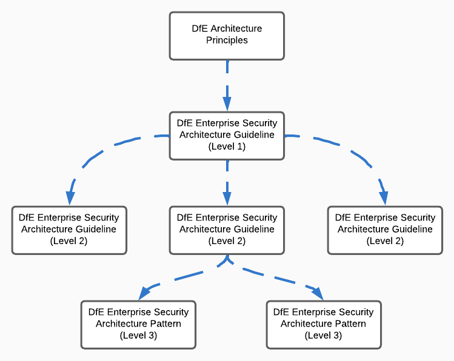

# Managing cloud permissions

| Document Information |
---|
| Category: Architecture Guidelines |
| Created: 21-02-2023 |
| Domain: Security |
| Author: pete.dingwall@education.gov.uk |
| References: |
| [GDL-IDE001-Authentication-principles](../Guidelines/GDL-IDE001-Authentication-principles.md) |
| [GDL-SEC005-Cloud-Platforms](../Guidelines/GDL-SEC005-Cloud-Guidelines.md) |

## Working with cloud permissions

>Need to apply cloud permissions appropriately, refer to indentity principles etc. Least privilege and JiT

## Use of the guidelines

This guideline is **level 2** and part of a hierarchy which inherits the guidelines from its corresponding [**level 1** guideline](../Guidelines/GDL-SEC005-Cloud-Guidelines.md). The information provided within provides  specfic guidelines for the specific technology or capability area underneath the **level 1** guideline.

This guideline is intended for Civil Servants, contract/contingent workers and Managed Service Providers (MSPs).

This guideline is non-exhaustive in nature.  The rapid pace of development within the cloud means that new storage mechanisms may become available.  

You should engage with [the architecture team](mailto:security.architecture@education.gov.uk) to discuss any novel approaches to storage **BEFORE** you start any use or development activity.

**Aligment and exceptions** to the principles will be reviewed as part of assurance processes with the security and architecture professions to streamline governance, Exceptions will be approved or declined as relevant, with all decisions tracked with rationale for future reference.

**Updates or modifications** to the principles can be requested initially via the Architecture Community of Interest, and in the future with standard updates and iterations via GitHub.

## Introduction

Cloud platforms provide rich capabilities for the provision and managemet of appropriate permissions across workloads. The methods of creating and applying roles and permissions vary from platform to platform, but all provide the ability to adhere to the Department's principles and security best practices. Focus within this guideline is for the Department's Azure platform, however the key principles will apply to any cloud platform used by the Department. 

### Azure permissions and structure

Azure provides a hierarchy where permissions can be applied at multiple levels, with broad permissions being applied at the top level for Azure workloads (Management Group) and finer-grained permissions being applied to the Subscription and Resource Groups within the subscription.

### Azure AD permissions and structure

AzureAD provides a flatter structure for the provision and management of appropriate permissions for administrative roles and the management of SaaS applications provided as part of the Microsoft 365 platform. In a change to how Active Directory was structured (with Organisational Units), AzureAD has a single flat structure and instead uses groups as scoping boundaries. Groups are used to create Administrative Units, and roles are applied to these groups to allow delegation of roles into specific groups of users and resources.

### Role-based access controls and alignment to team structure

The later appendices of these guidelines lists the roles which are available in each platform, and how they can be used.

The method of how these roles are applied is not dictated within these guidelines as it will depend on the structure of the team which is managing and supporting the relevant Azure workloads.

Some larger teams will have specific groups within which are responsible for specific elements of a service whereas smaller teams will have multi-disciplinary teams which support many parts of a service, and the access model will be adapted and shaped to match the needs of the team.

> Regardless of the team size and type, it is expected that the permissions applied to manage the relevant cloud resources will follow the principles outlined in the identity principles, adhering to least-privilege principles and just-in-time provision of permissions.

>Adherence to these principles will need to be demonstrated as part of ongoing service assurance with non-compliance reported and escated if required.

Roles will not be allocated permanently and will instead be granted on a just-in-time basis to ensure adherence with the least-privilege principle. 

Where roles are generally required for BAU purposes as part of a normal working day they will be permitted to be made available for up to 8 hours, and most roles are configured with self-approval to ensure that they can be requested and allocated quickly and easily. Permanent roles are not assigned to also ensure that all usage of privileged roles is done so consciously and with a clear business need.

**Using *scoping* capabilities in the cloud platform**

## 1. Refer to the Level 1 guidance for Cloud Platforms

*The Cloud Platforms guidelines provide the baseline security and best practices*

### Why?

Level 1 guidelines have been created to provide broad security guidelines for the correct use of cloud platforms within the Department. These apply across all cloud platforms to provide a secure and consistent baseline.

Applying these guidelines to architecture, design and deployment activities will simplify governance and compliance activities and allow teams to shift-left their assurance activities, reducing the burden on their teams and costs for the Department.

### How?

* Follow the level 1 guidelines [here](../Guidelines/GDL-SEC005-Cloud-Guidelines.md)
* Review these guidelines along with the more specific guidelines to ensure your service will meet the standard best practice configuration expected by the Department

## 2. Review and apply the guidance from the strategic identity guidelines

*Adhering to our strategic identity principles reduces risk and ensures conscious and appropriate use of privileges*

### Why?

It is essential that we manage the use of cloud permissions appropriately to protect the Department and our users from malicious use or unintended changes. Adhering to industry best practice ensures that we only have access to the roles and permissions when we need them, as this reduces the risk if a user's account is compromised.

Utilising just-in-time access also ensures that the use of operational and administrative roles is conscious, ensuring that we take due care when utilising these permissions instead of having a standard level of privileged access at all times.

### How?

* Follow the standard role usage outlined in these guidelines which already adhere to the strategic identity guidelines

* Apply the guidelines if you are creating custom roles and structuring your teams for operational activities in the Department's cloud platforms

  * Adhere to [Identity Principle 7 - Just-in-Time access](../Guidelines/GDL-IDE001-Authentication-principles.md#7-enable-just-in-time-access-for-administrative-permissions) to only apply permissions for as long as they are required. If the role is only required for a specific activity ensure you only request the role for the limited time window required.

  * Adhere to [Identity Principle 10 - Multi-Factor Authentication](../Guidelines/GDL-IDE001-Authentication-principles.md#10-consider-requirements-for-multi-factor-authentication-mfa) and ensure that the relevant MFA factors are used and are appropriate to the role being utilised.

  * Adhere to [Identity Principle 12 - Separation of Duties](../Guidelines/GDL-IDE001-Authentication-principles.md#12-support-role-segregation-and-separation-of-duties). Consider the roles used within your teams and, wherever possible, seek to separate specific roles and functions to specific sub-teams. Adhering to the SoD principle ensures that one specific person/team is not able to carry out all administrative or operational activities and ensures a level of oversight and rigour.

  * Adhere to [Identity Principle 14 - Least Privilege](../Guidelines/GDL-IDE001-Authentication-principles.md#14-adhere-to-least-privilege-model) to ensure that you only request the access required for the specific task at hand. Do not request or utilise high-levels of administrative access through convenience or simplicity, and minimise the use of high-level administrative roles.

## 3. Design and deploy a suitable RBAC model for your teams

*The RBAC model must apply permissions appropriately, following architecture principles and best practices*

### Why?

Inappropriate provision of access to operational and suport teams is a common attack vector used to gain access to an environment and then attempt to access other services across the Department (aka lateral movement). It is common for specific user types to be targeted due to the potential for them to have significant access to services, therefore it is key that we ensure that access is provided appropirately and only granted for the time period required. This ensures that even if an account is compromised it cannot be easily used to carry out malicious activity or enable access to other services and environments.

Where and how roles are applied to teams will vary depending on a number of factors, which will differ between teams and the services being managed. Some initial guidance is provided below to consider when planning and designing your RBAC model.

* **Size of team** - how will roles be carried out across the teams and which team members will be responsible for which activities?

* **Role(s) carried out** - which roles will the team need access to so they can support and maintain the relevant services?

* **The number of environments** - how many environments are required for the service and which team members will need access to which environment?

* **Environments shared with others** - are there shared services used by my team and service? What access do we need to this environment to effectively run and manage our services?

* **Use of contingent and full-time staff** - consider how roles which provide broad and/or high-levels of access are allocated, and potential constraints with providing high-privileged roles to contingent staff

* **Operating model**

* **Shared responsibility** - the type and level of access required will depend on the types of services and capabilites used witin cloud platforms. Aligning with best practices and utilising PaaS in favour of IaaS ensures that much of the low-level activities required to manage a service (patching, backups, updating) are carried out by the cloud vendor rather than your teams

### How?

* Adhere to vendor best practices (linky)

* Utilise scoping for roles (Management Groups in Azure, Managed Units in AzureAD)

* Apply roles at the correct level

* Adapt the RBAC structure as your team changes/evolves

* Document the structure with explanantion of how it's applied

* Be prepared for external scrutiny

* Commensurate roles in the different environments
Being aware that there's only one AzureAD, so can't apply more permissive roles in different environments

## Appendix A - AzureAD built-in roles

The following section lists all of the roles available via the AzureAD portal. These roles cover management of AzureAD, and also specific SaaS applications which are managed via the AzureAD and Microsoft 365 portals:
* SharePoint
* Exchange Online
* Teams
* Dynamics 365
* PowerBI
* Yammer

As per principle 2, roles will not be allocated permanently and will instead be granted on a just-in-time basis to ensure adherence with the least-privilege principle. Where roles are generally required for BAU purposes as part of a normal working day they will be permitted to be made available for up to 8 hours, and most roles are configured with self-approval to ensure that they can be requested and allocated quickly and easily. Permanent roles are not assigned to also ensure that all usage of privileged roles is done so consciously and with a clear business need.

*In the table below, default settings for roles are as follows:*
>|Approval | MFA | Time-Limited|
>--| --| --|
>| PIM Self-approval |no| 8 hours|

TBC has been used to identify roles which do not yet have a business need and will not be configured in PIM.

| Role| Description | Approval | MFA | Time-limited|
---| ---| ---| ---| --|
| Application Administrator | Can create and manage all aspects of app registrations and enterprise apps. | Default| soft-token | 2 Hours
| Application Developer | Can create application registrations independent of the 'Users can register applications' setting |Default| soft-token | 2 hours
|Attack Payload Author|Can create attack payloads that an administrator can initiate later.|tbc| tbc|
|Attack Simulation Administrator|Can create and manage all aspects of attack simulation campaigns.|tbc| tbc|
|Attribute Assignment Administrator|Assign custom security attribute keys and values to supported Azure AD objects.|Default| Default| Default
|Attribute Assignment Reader|Read custom security attribute keys and values for supported Azure AD objects.|Default| Default | Default
|Attribute Definition Administrator|Define and manage the definition of custom security attributes.|Default| Default | Default
|Attribute Definition Reader|Read the definition of custom security attributes |Default| Default | Default
|Authentication Administrator|Can access to view, set and reset authentication method information for any non-admin user.|Default| soft-token| 2 hours
|Authentication Policy Administrator|Can create and manage the authentication methods policy, tenant-wide MFA settings, password protection policy, and verifiable credentials.|admin-approved| hard-token | 2 hours
|Azure AD Joined Device Local Administrator|Users assigned to this role are added to the local administrators group on Azure AD-joined devices.|admin-approved| hard-token | 2 hours
|Azure DevOps Administrator|Can manage Azure DevOps policies and settings.|admin-approved| hard-token | 2 hours
|Azure Information Protection Administrator|Can manage all aspects of the Azure Information Protection product.|admin-approved| hard-token | 2 hours
|B2C IEF Keyset Administrator|Can manage secrets for federation and encryption in the Identity Experience Framework (IEF).|admin-approved| hard-token | 2 hours
|B2C IEF Policy Administrator|Can create and manage trust framework policies in the Identity Experience Framework (IEF).|admin-approved| hard-token | 2 hours
|Billing Administrator|Can perform common billing related tasks like updating payment information.|default| default| default
|Cloud App Security Administrator|Can manage all aspects of the Defender for Cloud Apps product.|admin-approved| hard-token | 2 hours
|Cloud Application Administrator|Can create and manage all aspects of app registrations and enterprise apps except App Proxy.|admin-approved| hard-token | 2 hours
|Cloud Device Administrator|Limited access to manage devices in Azure AD.|default| default| default
|Compliance Administrator|Can read and manage compliance configuration and reports in Azure AD and Microsoft 365.|default| default| default
|Compliance Data Administrator|Creates and manages compliance content.|default| default| default
|Conditional Access Administrator|Can manage Conditional Access capabilities.|admin-approved| hard-token | 2 hours
|Customer LockBox Access Approver|Can approve Microsoft support requests to access customer organizational data.|admin-approved| hard-token | 2 hours
|Desktop Analytics Administrator|Can access and manage Desktop management tools and services.|default| default| default
|Directory Readers|Can read basic directory information. Commonly used to grant directory read access to applications and guests.|default| default| default
|Directory Synchronization Accounts|Only used by Azure AD Connect service.|n/a| n/a|n/a|
|Directory Writers|Can read and write basic directory information. For granting access to applications, not intended for users.|n/a| n/a| n/a|
|Domain Name Administrator|Can manage domain names in cloud and on-premises.||default| default| default
|Dynamics 365 Administrator|Can manage all aspects of the Dynamics 365 product.|default| default| 2 hours
|Edge Administrator|Manage all aspects of Microsoft Edge.|tbc| tbc|
|Exchange Administrator|Can manage all aspects of the Exchange product.|admin-approved| hard-token | 2 hours
|Exchange Recipient Administrator|Can create or update Exchange Online recipients within the Exchange Online organization.|admi-approved| hard-token | 2 hours
|External ID User Flow Administrator|Can create and manage all aspects of user flows.|tbc| tbc|
|External ID User Flow Attribute Administrator|Can create and manage the attribute schema available to all user flows.|tbc| tbc|
|External Identity Provider Administrator|Can configure identity providers for use in direct federation.|admin-approved| hard-token | 2 hours
|Global Administrator|Can manage all aspects of Azure AD and Microsoft services that use Azure AD identities.|admin-approved| hard-token | 2 hours
|Global Reader|Can read everything that a Global Administrator can, but not update anything.|admin-approved| hard-token | 2 hours
|Groups Administrator|Members of this role can create/manage groups, create/manage groups settings like naming and expiration policies, and view groups activity and audit reports.|default| default| default
|Guest Inviter|Can invite guest users independent of the 'members can invite guests' setting.|default| default| default
|Helpdesk Administrator|Can reset passwords for non-administrators and Helpdesk Administrators.|default| default| default
|Hybrid Identity Administrator|Can manage AD to Azure AD cloud provisioning, Azure AD Connect, Pass-through Authentication (PTA), Password hash synchronization (PHS), Seamless Single sign-on (Seamless SSO), and federation settings.|admin-approved| hard-token | 2 hours
|Identity Governance Administrator|Manage access using Azure AD for identity governance scenarios.|admin-approved| hard-token | 2 hours
|Insights Administrator|Has administrative access in the Microsoft 365 Insights app.|tbc| tbc| tbc|
|Insights Analyst|Access the analytical capabilities in Microsoft Viva Insights and run custom queries.|tbc| tbc| tbc|
|Insights Business Leader|Can view and share dashboards and insights via the Microsoft 365 Insights app.|tbc| tbc| tbc|
|Intune Administrator|Can manage all aspects of the Intune product.|admin-approved| hard-token | 2 hours
|Kaizala Administrator|Can manage settings for Microsoft Kaizala.|tbc| tbc| tbc|
|Knowledge Administrator|Can configure knowledge, learning, and other intelligent features.|tbc| tbc| tbc||tbc| tbc| tbc|
|Knowledge Manager|Can organize, create, manage, and promote topics and knowledge.|tbc| tbc| tbc|
|License Administrator|Can manage product licenses on users and groups.|default| default| default
|Lifecycle Workflows Administrator|Create and manage all aspects of workflows and tasks associated with Lifecycle Workflows in Azure AD.|default| default| default
|Message Center Privacy Reader|Can read security messages and updates in Office 365 Message Center only.|default| default| default
|Message Center Reader|Can read messages and updates for their organization in Office 365 Message Center only.|default| default| default
|Microsoft Hardware Warranty Administrator|Create and manage all aspects warranty claims and entitlements for Microsoft manufactured hardware, like Surface and HoloLens.|tbc| tbc| tbc|
|Microsoft Hardware Warranty Specialist|Create and read warranty claims for Microsoft manufactured hardware, like Surface and HoloLens.|tbc| tbc| tbc|
|Modern Commerce User|Can manage commercial purchases for a company, department or team.|tbc| tbc| tbc|
|Network Administrator|Can manage network locations and review enterprise network design insights for Microsoft 365 Software as a Service applications.|default| default| default
|Office Apps Administrator|Can manage Office apps cloud services, including policy and settings management, and manage the ability to select, unselect and publish 'what's new' feature content to end-user's devices.|default| default| default
|Organizational Messages Writer|Write, publish, manage, and review the organizational messages for end-users through Microsoft product surfaces.|tbc| tbc| tbc|
|Partner Tier1 Support|Do not use - not intended for general use.|n/a| n/a| n/a|
|Partner Tier2 Support|Do not use - not intended for general use.|n/a| n/a| n/a|
|Password Administrator|Can reset passwords for non-administrators and Password Administrators.|default| default| default
|Permissions Management Administrator|Manage all aspects of Entra Permissions Management.|admin-approved| hard-token | 2 hours
|Power BI Administrator|Can manage all aspects of the Power BI product.|default| default| default
|Power Platform Administrator|Can create and manage all aspects of Microsoft Dynamics 365, Power Apps and Power Automate.|default| default| default |
|Printer Administrator|Can manage all aspects of printers and printer connectors.|default| default| default
|Printer Technician|Can register and unregister printers and update printer status.|default| default| default
|Privileged Authentication Administrator|Can access to view, set and reset authentication method information for any user (admin or non-admin).|admin-approved| hard-token | 2 hours
|Privileged Role Administrator|Can manage role assignments in Azure AD, and all aspects of Privileged Identity Management.|admin-approved| hard-token | 2 hours|
|Reports Reader|Can read sign-in and audit reports.|default| default| default |
|Search Administrator|Can create and manage all aspects of Microsoft Search settings.|default| default| default |
|Search Editor|Can create and manage the editorial content such as bookmarks, Q and As, locations, floorplan.|tbc| tbc| tbc|
|Security Administrator|Can read security information and reports, and manage configuration in Azure AD and Office 365.|default| default| default |
|Security Operator|Creates and manages security events.|default| default| default |
|Security Reader|Can read security information and reports in Azure AD and Office 365.|default| default| default |
|Service Support Administrator|Can read service health information and manage support tickets.|default| default| default |
|SharePoint Administrator|Can manage all aspects of the SharePoint service.|default| default| default |
|Skype for Business Administrator|Can manage all aspects of the Skype for Business product.|default| default| default |
|Teams Administrator|Can manage the Microsoft Teams service.|default| default| default |
|Teams Communications Administrator|Can manage calling and meetings features within the Microsoft Teams service.|default| default| default |
|Teams Communications Support Engineer|Can troubleshoot communications issues within Teams using advanced tools.|default| default| default |
|Teams Communications Support Specialist|Can troubleshoot communications issues within Teams using basic tools.|default| default| default |
|Teams Devices Administrator|Can perform management related tasks on Teams certified devices.|default| default| default |
|Tenant Creator|Create new Azure AD or Azure AD B2C tenants.|admin-approved| hard-token | 2 hours|
|Usage Summary Reports Reader|Can see only tenant level aggregates in Microsoft 365 Usage Analytics and Productivity Score.|default| default| default |
|User Administrator|Can manage all aspects of users and groups, including resetting passwords for limited admins.|default| default| default |
|Virtual Visits Administrator|Manage and share Virtual Visits information and metrics from admin centers or the Virtual Visits app.|tbc| tbc| tbc|
|Viva Goals Administrator|Manage and configure all aspects of Microsoft Viva Goals.|tbc| tbc| tbc|
|Windows 365 Administrator|Can provision and manage all aspects of Cloud PCs.|default| default| default |
|Windows Update Deployment Administrator|Can create and manage all aspects of Windows Update deployments through the Windows Update for Business deployment service.|default| default| default |
|Yammer Administrator|Manage all aspects of the Yammer service.|default| default| default |

## Appendix B - Azure built-in roles

The following section describes the built-in roles provided when deploying and managing services within Azure and how these are applied to the resources appropriately.

### General roles vs specific roles

General roles (also referred as 'classic' roles) are provided to enable general access to all resources within an Azure subscription. The broad nature of these general roles drives the need to protect and manage them appropriately. The service-specific roles only grant access to the specific permissions required (adhering to least-priciple) and therefore create a lower risk, meaning they can be allocated for longer periods of time and with less approval and oversight.

---

**General Roles**

| Role| Description | Approval | MFA | Time-limited|
---| ---| ---| ---| --|
| Owner | Grants full access to manage all resources and assign roles to other users **Will not be allocated to users** | admin-approved | hard-token | 2 hours|
| Contributor| Grants full access to manage all resources, but does not allow assigning roles for other users | self-approved | soft-token| 2 hours|
| Reader | Grants view access to all resources but does not allow any changes to be made | Self-approved | No| 8 hours|
| User access administrator | Allows management of access to Azure Resources **Will not be allocated to users** |admin-approved| hard-token | 2 hours|

---

**Service-specific roles**

| Role| Description | Team/competency alignment
---| ---| ---|
|Compute | Roles required for the management of traditional compute platforms, including storage and backup management | EUC teams |
|Networking | Roles required for the management of classic networking and DNS | Network teams |
|Storage | Roles required for the management of storage platforms, file shares and backup activities | Storage and backup teams |
|Web | Roles required for the management of websites, search services and APIs | Development teams
|Containers | Roles for the management of containers and kubernetes clusters | Development teams |
|Databases | Roles for the management of database platforms and services | Database Administrators |
|Analytics | Roles for the management of event hubs and log analytics | Service and security teams |
|AI & Machine Learning | Roles for the management of Machine Learning and Cognitive Services platforms | Data Science teams |
|Internet of Things |
|Mixed Reality |
|Integration |
|Identity |
|Security |
|DevOps |
|Monitor |
|Management and Governance |
|Virtual Desktop Infrastructure |
|Other |

>Provide details of the built-in roles for Azure and how they're used.

>Provide guidance for teams to create specific roles aligned to their structure and based upon principles highlighted above.

>Refer back to the access plane access to ensure that access is appropriate and from the approved devices