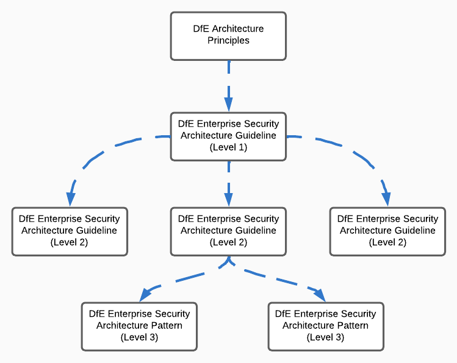

# Cloud Storage Patterns

| Document Information |
---|
| Category: Architecture Patterns |
| Created: 21-02-2023 |
| Domain: Security |
| Author: pete.dingwall@education.gov.uk |
| References: |
| [GDL-IDE001-Authentication-principles](../Guidelines/GDL-IDE001-Authentication-principles.md) |
| [GDL-SEC005-Cloud-Platforms](../Guidelines/GDL-SEC005-Cloud-Platforms.md) |
| [GDL-SEC006-Cloud Storage](../Guidelines/GDL-SEC006-Cloud-Storage.md) |

## Cloud Storage

Cloud storage offers systems and users the ability to create, read, update and delete data, that would have traditionally been held on disk, tape or other formats, using the internet.

This allows data to be accessed without geographical restrictions and takes advantages of the scalability and flexibility cloud service providers offer.

These patterns will identify standard cloud services and provide alignment with common use-cases across the Department. Alignment to these standard patterns will enable architects and service teams to re-use services which are already defined products within the Department, have agreed service wraps and are integrated into existing service and operational tooling.

In most cases the patterns can be used as-is with limited modification required other than to tailor for the specific service needs.

## Use of the patterns

This pattern line is **level 3** and part of a hierarchy which inherits the best practices and default configuration from its corresponding [**level 1 and level 2** guidelines linked in the references above.

This pattern is intended for Civil Servants, contract/contingent workers and Managed Service Providers (MSPs).

Services inculded in these patterns are non-exhaustive in nature.  The rapid pace of development within the cloud means that new storage mechanisms may become available.

---
> **Any services which are not included in these patterns are not approved for use and should not be used for any purpose within the Department. If you or your service team are using a service which is not included in this pattern you should plan to deprecate and remove this as soon as possible.**
---

>You should engage with [the architecture team](security.architecture@education.gov.uk) to discuss any novel approaches to storage **BEFORE** you start any use or development activity.

**Aligment and exceptions** to the patterns will be reviewed as part of assurance processes with the security and architecture professions to streamline governance, Exceptions will be approved or declined as relevant, with all decisions tracked with rationale for future reference.

**Updates or modifications** to the patterns can be requested initially via the Architecture Community of Interest, and in the future with standard updates and iterations via GitHub.

---

## PaaS Storage Patterns

The following section covers storage patterns which can be used directly as a platform. These services do not need to be connected to other cloud infrastructure to be utilised.

* Azure Blobs: A massively scalable object store for text and binary data. Also includes support for big data analytics through Data Lake Storage Gen2.

* Azure Files: Managed file shares for cloud or on-premises deployments.

### **Azure Blobs**

Azure Blobs are used for...

#### Vendor best practices

[Follow Security recommendations for blob storage](https://learn.microsoft.com/en-us/azure/storage/blobs/security-recommendations)

[Follow Azure Security Baseline for Storage](https://learn.microsoft.com/en-us/security/benchmark/azure/baselines/storage-security-baseline?toc=%2Fazure%2Fstorage%2Fblobs%2Ftoc.json%3Ftoc%3D%2Fazure%2Fstorage%2Fblobs%2FTOC.json)

#### Azure Blobs - Data Protection

* Turn on soft delete for blobs
* Turn on soft delete for containers
* Lock storage account to prevent accidental or malicious deletion or configuration changes
* Store business-critical data in immutable blobs
* Require secure transfer (HTTPS) to the storage account
* Limit shared access signature (SAS) tokens to HTTPS connections only

#### Azure Blobs - Identity and Access Management

* Use Azure Active Directory (Azure AD) to authorize access to blob data
* Use a user delegation SAS to grant limited access to blob data to clients
* Secure your account access keys with Azure Key Vault
* Regenerate your account keys periodically
* Disallow Shared Key authorization
* Have a revocation plan in place for any SAS that you issue to clients
* If a service SAS is not associated with a stored access policy, then set the expiry time to one hour or less
* Disable anonymous public read access to containers and blobs

#### Azure Blobs - Networking

* Enable the Secure transfer required option on all of your storage accounts
* Allow trusted Microsoft services to access the storage account
* Use private endpoints
* Use VNet service tags
* Limit network access to specific networks
* Configure network routing preference

#### Azure Blobs - Logging and Monitoring

* Track how requests are authorized
* Set up alerts in Azure Monitor

### **Azure Files**

Recommendation: Speak to Architecture and Infrastructure team

---

## IaaS Storage Patterns

The following section covers storage patterns which can be used when deploying traditional IaaS workloads. These services are provided to work alongside IaaS and are connected directly to IaaS workloads

### Azure Disks

* types of disks

* Appropriate use for system drives, data drives etc

* best practices to secure etc

## Database storage patterns

*not in scope for this pattern, covered in a separate database storage pattern [here](www.bbc.co.uk)*

## SaaS Storage Patterns

The following section covers storage patterns which are provided as SaaS and are typically used by end-users to directly interact with as a service. Whilst they can also be used by services to interact with this isn't their primary purpose and isn't advised.

### Onedrive for Business

End-user, refer to the KIM documentation for best practice usage

### SharePoint

End-user, refer to the KIM documentation for best practice usage

### Google Drive

End-user, refer to the KIM documentation for best practice usage. Marked for deprecation, plan to move from this platform as soon as possible.

## Non-standard storage platforms

### **Amazon Web Services (AWS)**

**If you are using AWS storage within your service/application, please work with your architecture partner to assess migration or exception.**

* [AWS Documentation](https://aws.amazon.com/documentation-overview/?nc2=h_ql_doc_do)

### Amazon S3 Object Storage

[Amazon Web Services (AWS) S3 object storage](https://aws.amazon.com/documentation-overview/s3/)

* Follow [Amazon Best Practice](https://docs.aws.amazon.com/AmazonS3/latest/userguide/security-best-practices.html)
* Use correct policies
* Block public access
* Implement least privilege access
* Use IAM roles for applications and AWS services that require Amazon S3 access
* Select an appropriate encryption strategy
* Consider encryption of data at rest
* Enforce encryption of data in transit
* Consider S3 Object Lock
* Enable versioning
  * Consider implementing on-going detective controls
* Apply an appropriate retention policy
* Consider Amazon S3 cross-region replication
* Consider VPC endpoints for Amazon S3 access
* Use managed AWS services to receive actionable findings in your AWS accounts
* Identify and audit all your Amazon S3 buckets
* Implement monitoring using AWS monitoring tools
* Enable Amazon S3 server access logging
* Use AWS CloudTrail
* Enable AWS Config
* Consider using Amazon Macie with Amazon S3
* Monitor AWS security advisories
* Still reading, wouldn't it just be easier to use Azure Storage?
