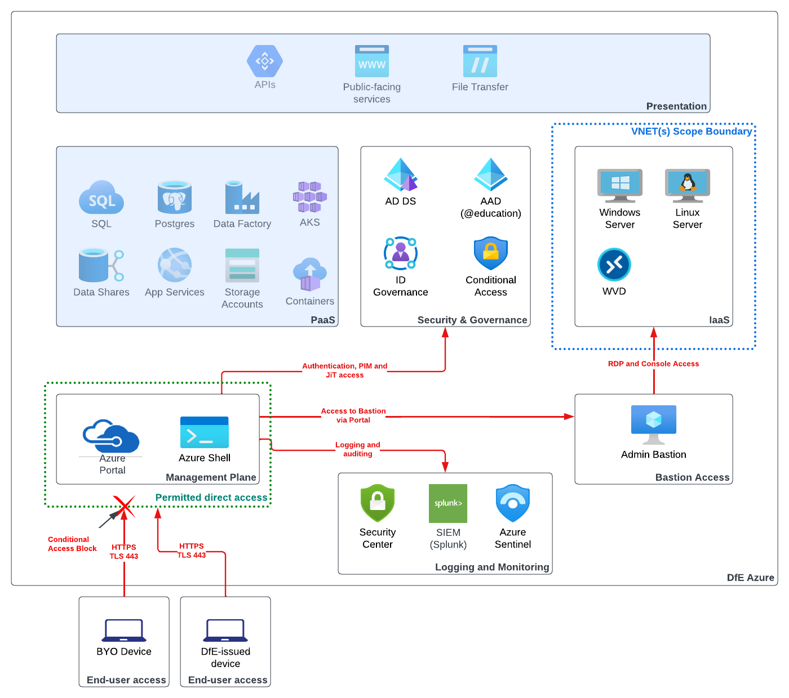

# Cloud Platforms Access Patterns

| Document Information |
---|
| Category: Architecture Patterns |
| Created: 21-02-2023 |
| Domain: Security |
| Author: pete.dingwall@education.gov.uk |
| References: |
| [GDL-IDE001-Authentication-principles](../Guidelines/GDL-IDE001-Authentication-principles.md) |
| [GDL-SEC005-Cloud-Platforms](../Guidelines/GDL-SEC005-Cloud-Guidelines.md) |

## Access to cloud platforms

The Department follows a cloud-first strategy when purchasing or building services, and aligns the hosting, management and security for these services with our strategic cloud and identity provider.

It is essential that access to these services is managed appropriately and is aligned with the best practice guidelines from the Department (see references.)

These guidelines explain the types and levels of access provided for the Department's users and how these are managed within Least Privilege and Just-in-time access best practices.

This will cover access from department-issued devices and bring-your-own, and will clarify how access will be granted to PaaS and IaaS workloads within the department's standard cloud platform.

The guidelines will also provide clear guidance for our users to understand which roles and access rights are provided at all times, and which are provided on a just-in-time and least-privilege basis.

## Use of the patterns

This pattern line is **level 3** and part of a hierarchy which inherits the best practices and default configuration from its corresponding [**level 1 and level 2** guidelines linked in the references above.

This pattern is intended for Civil Servants, contract/contingent workers and Managed Service Providers (MSPs).

Services inculded in these patterns are non-exhaustive in nature.  The rapid pace of development within the cloud means that new storage mechanisms may become available.

---

> **Any services which are not included in these patterns are not approved for use and should not be used for any purpose within the Department. If you or your service team are using a service which is not included in this pattern you should plan to deprecate and remove this as soon as possible.**
---

**Aligment and exceptions** to the principles will be reviewed as part of assurance processes with the security and architecture professions to streamline governance, Exceptions will be approved or declined as relevant, with all decisions tracked with rationale for future reference.

**Updates or modifications** to the principles can be requested initially via the Architecture Community of Interest, and in the future with standard updates and iterations via GitHub.

## 1. Access to Platform-as-a-service (PaaS) workloads

*PaaS is provided as a platform which is almost wholly managed by the cloud provider*

### Overview of Pattern

Accessing PaaS can be achieved directly via the standard Azure portal. Transport to the portal is encrypted end-to-end and can be accessed from any device with internet access and a supported web browser.

Once a user has successfully authenticated into the Azure portal they will have access to the specific PaaS services they are entitled to, and will be able to manage and configure the services via the portal.

Users will also be provided with access to the Azure Shell to allow the use of scripts and shell commands for the deployment and management of services.

>*Direct access to the portal and Azure shell is intended for the maintenance and support of platforms, and for incident resolution purposes. The use of the portal and shell for deployment activities is not permitted, any deployments into the Department's cloud platform should be via recognised and approved CI/CD pipelines with the approprise inline checks*

### Devices

* This pattern supports access from DfE issued devices. Unmanaged BYO devices are not permitted access, with network connectivity constrained by a conditional access policy which only permits access from DfE-managed devices.

### Authentication

* Authentication for this pattern requires a DfE-provided identity from the Microsoft AzureAD platform

* Guest accounts are not in-scope for this pattern

* MFA may be required for specific services and roles, either at login or when requesting additional roles via Privileged Access Management (PAM)

* Identity Protection will be utilised to monitor for any anomalous or inappropriate access or account usage

### Authorisation

* AzureAD ID Governance and Conditional Access will be utilised to manage access to roles and PaaS capabilities

* Broad and generic roles and permissions will not be permitted to any users other than central infrastructure & platforms personnel

* Authorisation will be granted based on least privilege principles, with sufficient permissions provided to allow the specific role(s) to be carried out

* Roles will be granted on a just-in-time basis to ensure that users have the required access when they need it, but do not maintain it when not required

* Roles will be mostly self-approved, to allow flexibility and autonomy for the users whilst also ensuring that the use of privileged roles is conscious and audited

* Specific roles which have broad privileges and access will require a central administrator to authorise the access to ensure that this is granted appropriately and with the correct level of oversight

* Specific roles may require approval by a permanent Civil Servant depending on the permissions and access provided

### Security

>*Insert relevant stuff here*

### Logging and Monitoring

* Access to the following services will be logged and audited
  * Azure Portal
  * Azure Shell
  * Access to PaaS
  * Elevation of roles via PAM
* Alerts triggered in Identity Protection for anomalous behaviour will be logged and audited for future action. Repeated inappropriate behaviour will result in access being revoked

### Benefits achieved with the pattern

* The pattern aligns with vendor best practices
* All access is from a single and consistent point of access
* Managment plane access is separated from public/front-end access
* The pattern supports access from all devices in-use in the Department
* Full alignment with Department guidelines
  * [GDL-IDE001-Authentication-principles](../Guidelines/GDL-IDE001-Authentication-principles.md)
  * [GDL-SEC005-Cloud-Platforms](../Guidelines/GDL-SEC005-Cloud-Guidelines.md)
* Alignment with Enterprise Architecture Principles
  * [Evaluate Total Cost of Ownership](https://dfe-digital.github.io/architecture/principles/enterprise-architecture-principles/#4-evaluate-total-cost-of-ownership)
  * [Deliver a Secure Service](https://dfe-digital.github.io/architecture/principles/enterprise-architecture-principles/#7-deliver-a-secure-service)
* Alignment with Government Cyber Security Strategy
  * Outcome 9 - Secure Technology and Digital Services
  * Outcome 11 - Secure Configuration
  * Outcome 12 - Shared Capabilities

## 2. Access to Infrastructure-as-a-service (IaaS) workloads

*IaaS is provided as a more traditional server platform, with the Department taking responsibiliy for OS, patching and maintainance*

### Overview of Pattern

Accessing IaaS workloads is not possible directly from the Azure portal as an interactive session is required from either a remote desktop or secure shell. Microsoft provide a standard bastion service which is used as a central point from within the Azure environment to 'fan out' onto the IaaS workloads to carry out tasks and activities from the respective interactive shell.

Once a user has successfully authenticated into the Azure portal they will have access to the Azure Bastion service and will be able to connect to the permitted IaaS workloads using the respective shell. Access to workloads will be restricted by VLANs to ensure that only the required access is permitted.

Transport to the portal is encrypted end-to-end and can be accessed from any device with internet access and a supported web browser. Access once connected to the portal will be across the Azure management network and secured end-to-end.

>*Direct access to IaaS workloads is intended for the maintenance and support of platforms, and for incident resolution purposes. The use of the portal and shell for deployment activities will be limited to agreed change windows and subject to change control*

### Devices

* This pattern supports access from DfE issued devices. Unmanaged BYO devices are not permitted access, with network connectivity constrained by a conditional access policy which only permits access from DfE-managed devices.

### Authentication

* Authentication for this pattern requires a DfE-provided identity from the Microsoft AzureAD platform

* Guest accounts are not in-scope for this pattern

* MFA will be required for specific services and roles, either at login or when requesting additional roles via Privileged Access Management (PAM) due to the potential high-level of access provided to the IaaS workload

* A separate login will be required to the IaaS workload which will be provided by **do we have a management AD?**

* Identity Protection will be utilised to monitor for any anomalous or inappropriate access or account usage

### Authorisation

* AzureAD ID Governance and Conditional Access will be utilised to manage access to roles and PaaS capabilities

* Broad and generic roles and permissions will not be permitted to any users other than central infrastructure & platforms personnel

* Authorisation will be granted based on least privilege principles, with sufficient permissions provided to allow the specific role(s) to be carried out

* Roles will be used to grant access to the relevant bastion environments and will be granted on a just-in-time basis to ensure that users have the required access when they need it, but do not maintain it when not required

* Access to IaaS workloads can be common across services within an environment but should not allow access across multiple environments
   * i.e. Access to production IaaS workloads and UAT IaaS workloads should utilise two separate accounts to maintain separation of duties and separation of environments

* Roles will be mostly self-approved, to allow flexibility and autonomy for the users whilst also ensuring that the use of privileged roles is conscious and audited

* Specific roles which have broad privileges and access will require a central administrator to authorise the access to ensure that this is granted appropriately and with the correct level of oversight

* Specific roles may require approval by a permanent Civil Servant depending on the permissions and access provided

### Security

>*Insert relevant stuff here*

### Logging and Monitoring

* Access to the following services will be logged and audited
  * Azure Portal
  * Azure Shell (if relevant or required)
  * Access to the Bastion service
  * Access to IaaS workloads
  * Elevation of roles via PAM
* Alerts triggered in Identity Protection for anomalous behaviour will be logged and audited for future action. Repeated inappropriate behaviour will result in access being revoked

### Benefits achieved with the pattern

* The pattern aligns with vendor best practices
* All access is from a single and consistent point of access
* Managment plane access is separated from public/front-end access
* The pattern supports access from all devices in-use in the Department
* Full alignment with Department guidelines
  * [GDL-IDE001-Authentication-principles](../Guidelines/GDL-IDE001-Authentication-principles.md)
  * [GDL-SEC005-Cloud-Platforms](../Guidelines/GDL-SEC005-Cloud-Guidelines.md)
* Alignment with Enterprise Architecture Principles
  * [Evaluate Total Cost of Ownership](https://dfe-digital.github.io/architecture/principles/enterprise-architecture-principles/#4-evaluate-total-cost-of-ownership)
  * [Deliver a Secure Service](https://dfe-digital.github.io/architecture/principles/enterprise-architecture-principles/#7-deliver-a-secure-service)
* Alignment with Government Cyber Security Strategy
  * Outcome 9 - Secure Technology and Digital Services
  * Outcome 11 - Secure Configuration
  * Outcome 12 - Shared Capabilities

