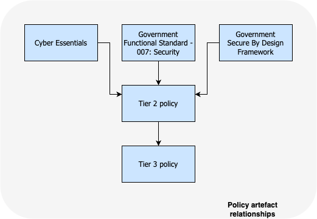

# Enterprise Security Architecture

## Introduction

This is a repository for artefacts created by the Enterprise Security Architecture team to provide guidance and advice and ensure systems and services are developed and maintained securely and according to best practices.

### Intended Audience
Artefacts within this repository are intended for:

1. Architects starting to develop new solutions, seeking guidance and advice to ensure that these are developed in-line with the Department, Government and Industry best practives
2. Vendors and 3rd party suppliers who need to understand standard working practices and guidelines when working with the Department and its services

## Types of artefacts

### Guidance

Guidance is [here](https://github.com/DFE-Digital/Enterprise-Security-Architecture/tree/main/Guidance)

**Guidance** is:

* Aligned to a specific technology, capability or service

* Provides freeform guidance for a varied audience depending on the content.

* Consists of background and rationale, and best practice guidance for consistency and security

**Intended audience** - All DfE users, contractors and Managed Service Providers working on behalf of the DfE

### Briefing Notes

Briefing Notes are [here](https://github.com/DFE-Digital/Enterprise-Security-Architecture/tree/main/Briefing-Notes)

**Briefing Notes** are:

* Aligned to a specific technology, capability or service

* Provide standard lines and messaging for a subject which may be emerging or novel and isn't yet sufficiently mature for more formal guidance or guidelines

* Consist of background and rationale, and best practice guidance for consistency and security

**Intended audience** - All DfE users, contractors and Managed Service Providers working on behalf of the DfE

### Job Descriptions

Job Descriptions are [here](https://github.com/DFE-Digital/Enterprise-Security-Architecture/tree/main/Job-Descriptions)

**Job Descriptions** are:

* Relevant to roles within the Cyber and InfoSec Division

**Intended audience** - C&IS teams and other DfE teams with similar job roles

### Guidelines

Guidelines are [here](https://github.com/DFE-Digital/Enterprise-Security-Architecture/tree/main/Principles)

**Guidelines** are:

* Aligned to a specific technology, capability or service

* Provide specific details of standard ways of working and operating within the Department.

* Consists of a list of specific guidelines, with each one providing a summary, why the guideline is required and how to adhere to it

**Intended audience** - DfE product and delivery teams, DfE service providers and contractors

### Tier2 Policies

Guidelines are [here](https://github.com/DFE-Digital/Enterprise-Security-Architecture/tree/main/Tier2-Policies)

**Tier 2 Policies** are:

* Aligned to a specific ISMS Tier 1 security policy

* Provides the 'how' for the Tier 1 security policy with further details and specific settings

* Consists of background and rationale for specific policy elements and settings, and how the Tier1 policy is applied and adhered to

**Intended audience** - All DfE users, contractors and Managed Service Providers working on behalf of the DfE

## Relationship of artefacts

Arteacts created by the Security Architecture team are informed and supported by existing standards and frameworks used across other Government Departments and the IT industry. We will re-use and cross-reference exisisting guidance at all times and augment with relevant content for the Department.

### Architecture artefacts

Security Architecture artefacts (Guidelines, Briefing Notes, Guidance and Patterns) are part of an overall hierarchy of artefacts used within the Department.

The relationship between the artefacts is hierarchical and cumulative, meaning that the top-level artefacts inform the next level of artefacts and so on.

The security architecture artefacts will therefore reference and leverage the higher-level standards and principles and provide the security-specific lens to ensure that delivery and support teams using these standards, principles and guidelines are creating and supporting secure services.

### Policy artefacts

The Security Architecture team work alongside the InfoSec profession to co-develop the Department's Information Security policies within the ISMS.

Policies created for the Department are informed and supported by existing standards and frameworks provided by central government and the IT industry.

The relationship is hierarchical and cumulative, meaning that the top-level policies and standards inform the Department's policies.

The Tier 1 policy is developed and maintained by InfoSec within the Department and contains the high-level details of the specific policy area.

The Tier 2 policy is developed and maintained by the Security Architecture team, and provides the next level of detail for the policy, including the specific details of how to implement the policy.