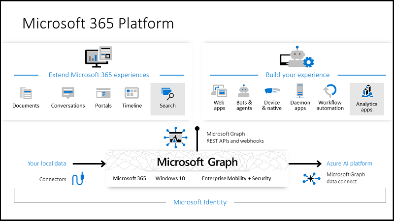

# Security Service Definitions - Microsoft GraphAPI Access

| Document Information |
---|
| Category: Service Definition |
| Created: 29-06-2023 |
| Domain: Security |
| Author: <pete.dingwall@education.gov.uk> |
| References: None |
| Document Status: **DRAFT** |

## Introduction and background

Service definitions are provided by the Cyber and Information Security Division (C&IS) and used by service teams to understand:

1. Which standard services are provided
2. What is the scope of the service offering
3. How they're requested
4. What information is required by the team providing the service
5. Expertise required by the requesting team
6. What the C&IS team will provide back to the service

---

### Microsoft GraphAPI

#### **Service Definition**

GraphAPI is Microsoft's standard method of providing programmatic access to applications which are part of the Microsoft 365 and Azure ecosystem. User-level access is provided transparently as part of access to the relevant applications which have been licensed, but programmatic access requires specific permissions to be applied by the C&IS team which manages the AzureAD identity platform.

Example uses for this type of access would be:

- A SaaS application which needs to access Dynamics 365 for customer contact information
- A Robotics Process Automation (RPA) task which needs to interact with multiple SharePoint platforms to automate a manual task
- A  service which needs to gather information from multiple platforms for analytics purposes

#### **Scope**

The GraphAPI Access service can be used for any service which supports standard API integration.

Access to the resources within the GraphAPI service must be granted based upon least-privilege so service owners will be expected to demonstrate how their access is constrained to the relevant information only.

Services will need to support modern authentication methods (SAML V2.0, OIDC) to connect to the GraphAPI service and will require a functional account which is named appropriately.

#### **How to request the service**

The service can be requested via ServiceNow for the attention of the IDAM team. Standard response times for requests are X working days.

The time to complete the work will depend on the complexity of the request, the IDAM team will discuss this with you once they have all of the required information.

*There are no escalation routes to expedite requests, so please ensure that you plan appropriately within yor project.*

#### **Information required**

The following information must be provided to support the service team to fulfill the request. All information is mandatory unless otherwise stated.

- Name of the service(s) which requires GraphAPI access
- Which application(s) will be accessed via GraphAPI
- Which data fields will be accessed within each service
- Design for the service
- Evidence of adherence to [API Security Principles](../Guidelines/GDL-SEC001-API-Security-Principles.md)
- Evidence of assurance oversight from:
  - Security
  - Data Protection Office
- A data flow diagram (for threat modelling) showing at least the following:
  - Where the service is hosted
  - Trust boundaries
  - Connectivity between the service and other services and/or data stores as relevant
  - Data being exchanged by the service
  - Protocols used by the service
- Functional account(s) which will be used to provide access to the relevant GraphAPI endpoints

#### **Expertise required**

The requesting team will be expected to provide the following expertise to support the request:

- Technical architecture to provide the design and overview of the service
- SME support to provide the in-depth knowledge of the service. This could be an internal resource or the vendor providing the service
- Data architecture support may be required, depending on the complexity of the integration

#### **Output provided**

The IDAM team will work with the service to configure and test the service to confirm that SSO is working as expected.

Once the GraphAPI integration work is completed, it is expected that there will be no further involvement from the IDAM team for ongoing management of the service, unless there is a signficant change which would require a change to the SSO integration.
